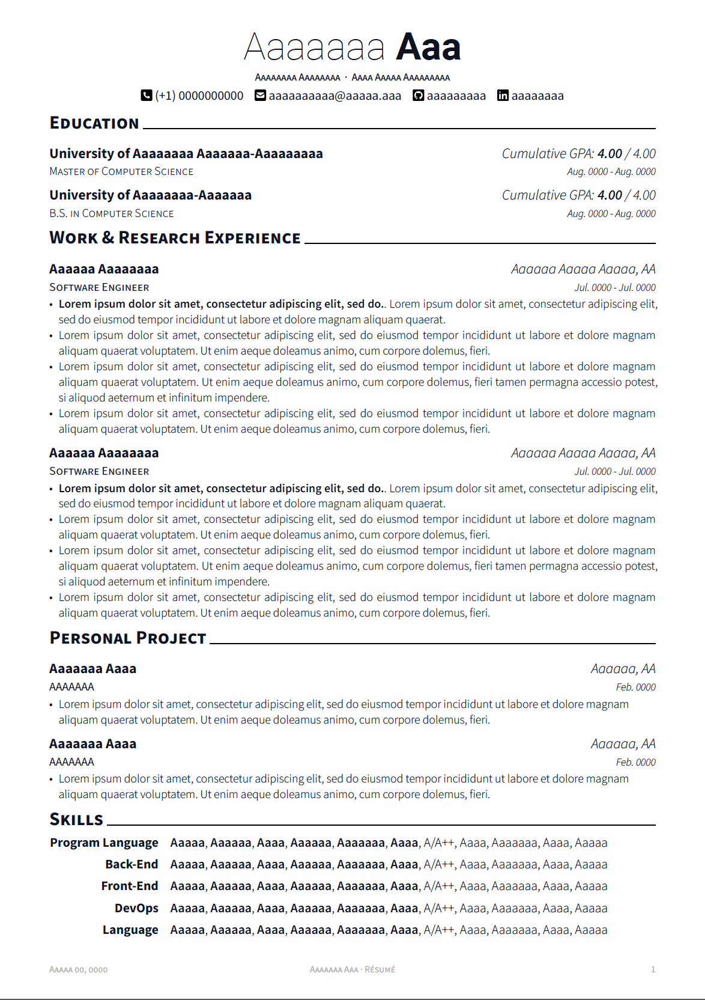

# Typst Resume Template

A simple resume template for [typst.app](https://typst.app/).

Aesthetic style inspired by the [Awesome-CV](https://github.com/posquit0/Awesome-CV) project.

This is not a perfect clone, the main purpose of this project is to explore and experiment with Typst's typography features.

## Sample



## Development Environment

- Install [Typst](https://github.com/typst/typst)

- Install [Just](https://github.com/casey/just)

## Build Resume

```bash
just build
```

## Interactive Development Resume

```bash
just dev
```

## Containerized Build

```bash
# TODO
docker run --rm -t -v \
  "$(pwd):/mnt" \
  -w "/mnt" \
  typst:latest \
  resume.typ
```

## Credit

[**Typst**](https://github.com/typst/typst) is a new markup-based typesetting system that is designed to be as powerful as LaTeX while being much easier to learn and use.

[**FontAwesome**](https://fontawesome.com/) is the Internet's icon library and toolkit, used by millions of designers, developers, and content creators.

[**Roboto**](https://github.com/google/roboto) is the default font on Android and ChromeOS, and the recommended font for Google’s visual language, Material Design.

[**Source Sans Pro**](https://github.com/adobe-fonts/source-sans-pro) is a set of OpenType fonts that have been designed to work well in user interface (UI) environments.

## Declaration

If you want to see a more realistic example rendered using this template, check [this](https://github.com/bamboovir/typst-resume-template/blob/main/huiming-sun-sde-resume.pdf).

You are free to take my .typ template and modify it to create your own resume. **Please don't use my resume for anything else without my permission, though!**
